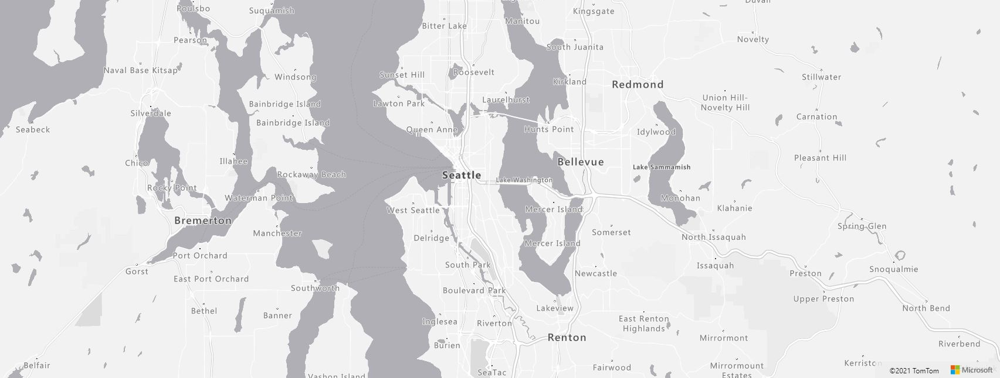
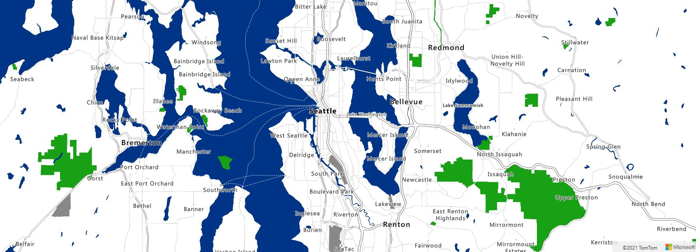

# Azure Maps supported built-in map styles

Azure Maps supports several different built-in map styles as described below.

>[!important]
>The procedure in this section requires an Azure Maps account in Gen 1 or Gen 2 pricing tier. For more information on pricing tiers, see [Choose the right pricing tier in Azure Maps](choose-pricing-tier.md).

## road

A **road** map is a standard map that displays roads. It also displays natural and artificial features, and the labels for those features.

**Applicable APIs:**

* [Map image](/rest/api/maps/render/getmapimage)
* [Map tile](/rest/api/maps/render/getmaptile)
* Web SDK map control
* Android map control
* Power BI visual

## blank and blank_accessible

The **blank** and **blank_accessible** map styles provide a blank canvas for visualizing data. The **blank_accessible** style will continue to provide screen reader updates with map's location details, even though the base map isn't displayed.

> [!Note]
> In the Web SDK, you can change the background color of the map by setting the CSS `background-color` style of map DIV element.

**Applicable APIs:**

* Web SDK map control

## satellite

The **satellite** style is a combination of satellite and aerial imagery.

**Applicable APIs:**

* [Satellite tile](/rest/api/maps/render/getmapimagerytilepreview)
* Web SDK map control
* Android map control
* Power BI visual

## satellite_road_labels

This map style is a hybrid of roads and labels overlaid on top of satellite and aerial imagery.

**Applicable APIs:**

* Web SDK map control
* Android map control
* Power BI visual

## grayscale_dark

**grayscale dark** is a dark version of the road map style.

**Applicable APIs:**

* [Map image](/rest/api/maps/render/getmapimage)
* [Map tile](/rest/api/maps/render/getmaptile)
* Web SDK map control
* Android map control
* Power BI visual

## grayscale_light

**grayscale light** is a light version of the road map style.

**Applicable APIs:**
* Web SDK map control
* Android map control
* Power BI visual

## night

**night** is a dark version of the road map style with colored roads and symbols.

**Applicable APIs:**

* Web SDK map control
* Android map control
* Power BI visual

## road_shaded_relief

**road shaded relief** is an Azure Maps main style completed with contours of the Earth.

**Applicable APIs:**

* [Map tile](/rest/api/maps/render/getmaptile)
* Web SDK map control
* Android map control
* Power BI visual

## high_contrast_dark

**high_contrast_dark** is a dark map style with a higher contrast than the other styles.

**Applicable APIs:**

* Web SDK map control
* Android map control
* Power BI visual

## high_contrast_light

**high_contrast_light** is a light map style with a higher contrast than the other styles.

**Applicable APIs:**

* Web SDK map control
* Android map control
* Power BI visual

## Map style accessibility

The interactive Azure Maps map controls use vector tiles in the map styles to power the screen reader to describe the area the map is displaying. Several map styles are also designed to be fully accessible when it comes to color contrast. The following table provides details on the accessibility features supported by each map style.

| Map style  | Color contrast | Screen reader | Notes |
|------------|----------------|---------------|-------|
| `blank` | N/A | No | A blank canvas useful for developers who want to use their own tiles as the base map, or want to view their data without any background. The screen reader will not rely on the vector tiles for descriptions.  |
| `blank_accessible` | N/A  | Yes | Under the hood this map style continues to load the vector tiles used to render the map, but makes that data transparent. This way the data will still be loaded, and can be used to power the screen reader. |
| `grayscale_dark` | Partial | Yes | This map style is primarily designed for business intelligence scenarios but useful for overlaying colorful layers such as weather radar imagery. |
| `grayscale_light` | Partial | Yes | This map style is primarily designed for business intelligence scenarios. |
| `high_contrast_dark` | Yes | Yes | Fully accessible map style for users in high contrast mode with a dark setting. When the map loads, high contrast settings will automatically be detected. |
| `high_contrast_light` | Yes | Yes | Fully accessible map style for users in high contrast mode with a light setting. When the map loads, high contrast settings will automatically be detected. |
| `night` | Partial | Yes | This style is designed for when the user is in low light conditions and you don’t want to overwhelm their senses with a bright map. |
| `road` | Partial | Yes | This is the main colorful road map style in Azure Maps. Due to the number of different colors and possible overlapping color combinations, it's nearly impossible to make it 100% accessible. That said, this map style goes through regular accessibility testing and is improved as needed to make labels clearer to read. |
| `road_shaded_relief` | Partial | Yes | This is nearly the same style the main road map style, but has an added tile layer in the background that adds shaded relief of mountains and land cover coloring when zoomed out at higher levels. |
| `satellite` | N/A | Yes | Purely satellite and aerial imagery, no labels, or road lines. The vector tiles are loaded behind the scenes to power the screen reader and to make for a smoother transition when switching to `satellite_with_roads`. |
| `satellite_with_roads` | No | Yes | Satellite and aerial imagery, with labels and road lines overlaid. On a global scale, there is an unlimited number of color combinations that may occur between the overlaid data and the imagery. A focus on making labels readable in most common scenarios, however, in some places the color contrast with the background imagery may make labels difficult to read. |

## Next steps

Learn about how to set a map style in Azure Maps:

> [!div class="nextstepaction"]
> [Choose a map style](./choose-map-style.md)
