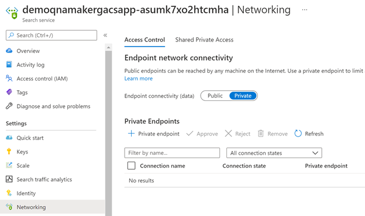
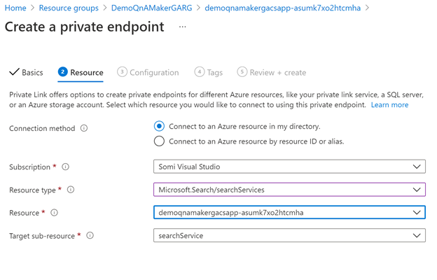
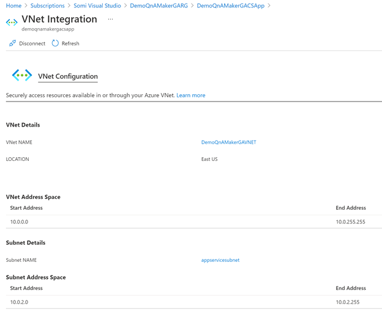

# Recommended settings for network isolation

Follow the steps below to restrict public access to QnA Maker resources. Protect a Cognitive Services resource from public access by [configuring the virtual network](../../cognitive-services-virtual-networks.md?tabs=portal).

## Restrict access to App Service (QnA runtime)

# [QnA Maker GA (stable release)](#tab/v1)

You can use the ServiceTag `CognitiveServicesMangement` to restrict inbound access to App Service or ASE (App Service Environment) network security group in-bound rules. Check out more information about service tags in the [virtual network service tags article](../../../virtual-network/service-tags-overview.md). 

### Regular App Service

1. Open the Cloud Shell (PowerShell) from the Azure portal.
2. Run the following command in the PowerShell window at the bottom of the page:

```ps
Add-AzWebAppAccessRestrictionRule -ResourceGroupName "<resource group name>" -WebAppName "<app service name>" -Name "cognitive services Tag" -Priority 100 -Action Allow -ServiceTag "CognitiveServicesManagement" 
```
3.  Verify the added access rule is present in the **Access Restrictions** section of the **Networking** tab:  

    > [!div class="mx-imgBorder"]
    > [  ](  ../media/network-isolation/access-restrictions.png#lightbox)

4. To access the **Test pane** on the https://qnamaker.ai portal, add the **Public IP address of the machine** from where you want to access the portal. From the **Access Restrictions** page select **Add Rule**, and allow access to your client IP. 

    > [!div class="mx-imgBorder"]
    > [  ](  ../media/network-isolation/public-address.png#lightbox)

### Configure App Service Environment to host QnA Maker App Service

The App Service Environment (ASE) can be used to host the QnA Maker App Service instance. Follow the steps below:

1. Create a [new Azure Cognitive Search Resource](https://ms.portal.azure.com/#create/Microsoft.Search).
2. Create an external ASE with App Service.
    - Follow this [App Service quickstart](../../../app-service/environment/create-external-ase.md#create-an-ase-and-an-app-service-plan-together) for instructions. This process can take up to 1-2 hours.
    - Finally, you will have an App Service endpoint that will appear similar to: `https://<app service name>.<ASE name>.p.azurewebsite.net` . 
	- Example: `https:// mywebsite.myase.p.azurewebsite.net`  
3. Add the following App service configurations:
    
    | Name                       | Value                                                     |
    |:---------------------------|:----------------------------------------------------------| 
    | PrimaryEndpointKey         | `<app service name>-PrimaryEndpointKey`                   | 
    | AzureSearchName            | `<Azure Cognitive Search Resource Name from step #1>`     | 
    | AzureSearchAdminKey        | `<Azure Cognitive Search Resource admin Key from step #1>`| 
    | QNAMAKER_EXTENSION_VERSION | `latest`                                                  |
    | DefaultAnswer              | `no answer found`                                         |

4. Add CORS origin "*" on the App Service to allow access to https://qnamaker.ai portal Test pane. **CORS** is located under the API header in the App Service pane.

    > [!div class="mx-imgBorder"]
    > [  ](  ../media/network-isolation/cross-orgin-resource-sharing.png#lightbox)

5. Create a QnA Maker Cognitive Services instance (Microsoft.CognitiveServices/accounts) using Azure Resource Manager. The QnA Maker endpoint should be set to the App Service Endpoint created above (`https:// mywebsite.myase.p.azurewebsite.net`). Here is a [sample Azure Resource Manager template you can use for reference](https://github.com/pchoudhari/QnAMakerBackupRestore/tree/master/QnAMakerASEArmTemplate).

### Related questions

#### Can QnA Maker be deployed to an internal ASE? 

The main reason for using an external ASE is so the QnAMaker service backend (authoring apis) can reach the App Service via the Internet. However, you can still protect it by adding inbound access restriction to allow only connections from addresses associated with the `CognitiveServicesManagement` service tag.

If you still want to use an internal ASE, you need to expose that specific QnA Maker app in the ASE on a public domain via the app gateway DNS TLS/SSL cert. For more information, see this [article on Enterprise deployment of App Services](/azure/architecture/reference-architectures/enterprise-integration/ase-standard-deployment).

    
# [Custom question answering (preview release)](#tab/v2)

App Service is not deployed with custom question answering.

---

## Restrict access to Cognitive Search resource

# [QnA Maker GA (stable release)](#tab/v1)

The Cognitive Search instance can be isolated via a private endpoint after the QnA Maker resources have been created. Use the following steps to lock down access:

1. Create a new [virtual network (VNet)](https://portal.azure.com/#create/Microsoft.VirtualNetwork-ARM) or use existing VNet of ASE (App Service Environment).
2. Open the VNet resource, then under the **Subnets** tab create two subnets. One for the App Service **(appservicesubnet)** and another subnet **(searchservicesubnet)** for the Cognitive Search resource without delegation. 

    > [!div class="mx-imgBorder"]
    > [  ](  ../media/network-isolation/subnets.png#lightbox)

3. In the **Networking** tab in the Cognitive Search service instance switch endpoint connectivity data from public to private. This operation is a long running process and **can take up to 30 minutes** to complete.

    > [!div class="mx-imgBorder"]
    > [  ](  ../media/network-isolation/private.png#lightbox)

4. Once the Search resource is switched to private, select add **private endpoint**.
    - **Basic tab**: make sure you are creating your endpoint in the same region as search resource.
    - **Resource tab**: select the required search resource of type `Microsoft.Search/searchServices`.

    > [!div class="mx-imgBorder"]
    > [  ](  ../media/network-isolation/private-endpoint.png#lightbox)

    - **Configuration tab**:  use the VNet, subnet (searchservicesubnet) created in step 2. After that, in section **Private DNS integration** select the corresponding subscription and create a new private DNS zone called **privatelink.search.windows.net**.

     > [!div class="mx-imgBorder"]
     > [  ](  ../media/network-isolation/subnet.png#lightbox)

    5. Enable VNET integration for the regular App Service. You can skip this step for ASE, as that already has access to the VNET.
        - Go to App Service **Networking** section, and open **VNet Integration**.
        - Link to the dedicated App Service VNet, Subnet (appservicevnet) created in step 2.
    
     > [!div class="mx-imgBorder"]
     > [  ](  ../media/network-isolation/integration.png#lightbox)


# [Custom question answering (preview release)](#tab/v2)

[Create Private endpoints](../reference-private-endpoint.md) to the Azure Search resource.

Follow the steps below to restrict public access to QnA Maker resources. Protect a Cognitive Services resource from public access by [configuring the virtual network](../../cognitive-services-virtual-networks.md?tabs=portal).

After restricting access to Cognitive Service resource based on VNet, To browse knowledgebases on the https://qnamaker.ai portal from your on-premises network or your local browser.
- Grant access to [on-premises network](../../cognitive-services-virtual-networks.md?tabs=portal#configuring-access-from-on-premises-networks).
- Grant access to your [local browser/machine](../../cognitive-services-virtual-networks.md?tabs=portal#managing-ip-network-rules).
- Add the **public IP address of the machine  under the Firewall** section of the **Networking** tab. By default `portal.azure.com` shows the current browsing machine's public IP (select this entry) and then select **Save**.

     > [!div class="mx-imgBorder"]
     > [  ](  ../media/network-isolation/firewall.png#lightbox)

---

